<div align="center">

<!-- ANIMATED HERO BANNER — save hero.svg in same repo and reference it -->


<br/>

[](https://git.io/typing-svg)

<br/>

[](https://zikzik-portfolio.vercel.app/)
[](https://linkedin.com/in/razikk09)
[](https://instagram.com/razikk_09)
[](mailto:razzikk09@gmail.com)

</div>

---

## 👋 Hey, I'm Razik

I'm a **Full-Stack Developer**, **Electronics & Computer Engineering student** at BSA Crescent Institute, and a hands-on **IoT / hardware builder** — obsessed with making things that actually work, whether that's a web app, a sensor circuit, or a full startup product.

I founded **ZikZik Studio** — a freelance agency building clean web apps, AI tools, and SaaS products. I also contribute to **Shas Det**, a food safety startup using gas sensors and real-time IoT to detect meat spoilage before it reaches the consumer.

Currently expanding into **SwiftUI & iOS development**, because the hardware and software worlds are converging — and I want to be at that intersection.

```js
const razik = {
  location: "Chennai, Tamil Nadu 🇮🇳",
  studying:  "B.Tech ECE @ BSA Crescent (2024–2028)",
  building:  ["ZikZik Studio", "Shas Det (Food Safety IoT)", "Padi Da"],
  hardware:  ["Arduino", "Raspberry Pi", "Gas Sensors", "RFID", "Embedded C"],
  learning:  ["SwiftUI", "iOS Development", "Machine Learning"],
  openTo:    ["Freelance", "Internships", "Collabs", "Startups"],
  funFact:   "I design the UI before I write a single line of code 🎨"
};
```

---

## 🚀 What I Build

<table>
<tr>
<td width="50%">

### 🌾 FarmGrow AI
Platform helping farmers with **crop insights, growth tracking**, and AI-powered **image recognition** for plant disease detection — bridging computer vision with real agriculture.

`Python` `Flask` `AI` `Image Recognition` `React`

</td>
<td width="50%">

### 🥩 Shas Det — Food Safety Startup 
**Smart meat freshness detection** using gas sensors + IoT. Built hardware & software — real-time spoilage monitoring, freshness classification, interactive web dashboard.

`IoT` `Gas Sensors` `Python` `React` `Data Visualization`

🌐 [shas-det.vercel.app](https://shas-det.vercel.app/) · 📊 [Live Dashboard](https://freshness-meat-detector.vercel.app/)

</td>
</tr>
<tr>
<td width="50%">

### 🎯 Padi Da
**Productivity & focus platform** for students — time management, distraction reduction, habit tracking, and smart study tools built around how students actually think.

`Next.js` `React` `Firebase` `JavaScript`

</td>
<td width="50%">

### 🤫 Whispr
**Anonymous messaging app** with secure message flow, reveal logic, and thoughtful user-safety design baked in from day one.

`Next.js` `Firebase` `JavaScript`

</td>
</tr>
<tr>
<td width="50%">

### 📡 RFID Attendance System UI
**Clean, minimal dashboard** for tracking student attendance via RFID hardware — built for accuracy and ease of use for institutions.

`React` `Firebase` `IoT` `Arduino`

</td>
<td width="50%">

### 📄 AI Insurance Claim Analyzer
**Flask application** that processes and analyzes insurance documents using AI — cutting manual review time significantly.

`Python` `Flask` `AI` `PDF Processing`

</td>
</tr>
</table>

---

## ⚡ Electronics & IoT Work

I'm not just a web developer — I build things in the physical world too. My electronics background is core to how I think about systems.

```
Hardware I've worked with:
┌─────────────────────────────────────────────────────────┐
│  🔌 Arduino Uno / Nano — sensor circuits, data logging  │
│  🍓 Raspberry Pi      — edge computing, IoT gateways    │
│  📡 RFID Modules       — attendance, access control     │
│  🧪 Gas Sensors (MQ series) — Shas Det spoilage detect  │
│  📟 LCD / OLED Displays  — embedded UI                  │
│  🔧 Embedded C / Python  — firmware & sensor logic      │
└─────────────────────────────────────────────────────────┘
```

> Certified in **Arduino (IIT Bombay)** · **Linux (IIT Bombay)** · **iOS App Dev**

---

## 🛠️ Tech Stack

**Languages**


**Frontend**


**Backend & Cloud**


**AI / ML & Vision**


**Hardware & IoT**


**Design & Tools**


---

## 📅 My Journey So Far

```text
2024 ──────────────────────────────────────────────────────► 2026

Jan 2024   Founded ZikZik Studio — freelance web & AI dev
           ████████████████████████████████████████████████

Aug 2024   Started B.Tech ECE @ BSA Crescent Institute
           ████████████████████████████████████████

2025       Built FarmGrow AI — image recognition + crop insights
           ████████████████████████████████

2025       Joined Crescent Innovation & Startup Club
           ████████████████████████

2025       Shas Det — Food Safety Startup (IoT + Web + Sensors)
           ████████████████████

2025–26    Padi Da — Student Productivity & Focus Platform
           ████████████████

2026       Exploring SwiftUI & iOS App Development
           ██████████ → building...
```

---

## 📊 GitHub Activity

<div align="center">

[](https://github.com/ashutosh00710/github-readme-activity-graph)

</div>

<div align="center">


&nbsp;&nbsp;


</div>

> 💡 *Most of my active work lives in private repos — client projects, SaaS builds, IoT firmware, and startup work. The calendar is the real picture.*

---

## 🌐 Portfolio & Live Apps

<div align="center">

| 🚀 | Project | Live Link |
|---|---|---|
| 🌐 | Personal Portfolio | [zikzik-portfolio.vercel.app](https://zikzik-portfolio.vercel.app/) |
| 🥩 | Shas Det — Food Safety | [shas-det.vercel.app](https://shas-det.vercel.app/) |
| 📊 | Freshness Dashboard | [freshness-meat-detector.vercel.app](https://freshness-meat-detector.vercel.app/) |

> Portfolio built with **Next.js · Tailwind · Framer Motion · Three.js**

</div>

---

## 🏆 Certifications

<div align="center">

| 🏅 Certification | 🏛️ Issued By |
|---|---|
| iOS Application Development | Apple / Coursera |
| Arduino Training Certification | IIT Bombay |
| Linux Training Certification | IIT Bombay |

</div>

---

<div align="center">

### 💬 Let's build something great together

*Open to freelance projects, startup collabs, IoT builds, and internship opportunities.*

[](mailto:razzikk09@gmail.com)
[](https://linkedin.com/in/razikk09)
[](https://zikzik-portfolio.vercel.app/)

<br/>

### 💰 Support My Work

*If something I built helped you, or you just want to cheer me on — every bit counts!*

[](https://paypal.me/RazikMohammed09)

<br/>

[](https://github.com/razzikk09-zikzik)

---

*"I don't just write code — I build products people actually want to use."*

**— Mohammed Razik** · ZikZik Studio · Chennai, India

</div>
